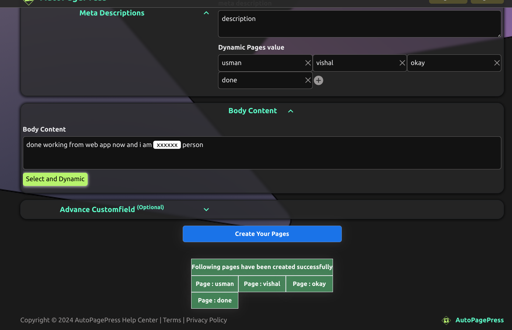
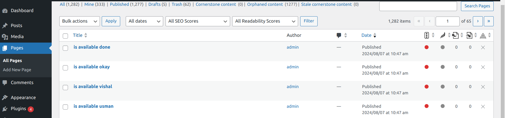
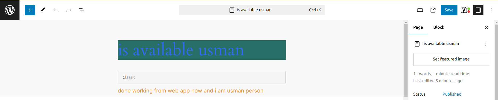

```

# server
npm install
npm run lint:fix
npm run format
num run dev | npm start

# Frontend
cd client
npm install
npm start
```

## USES AND RESULTP application and wordpress





## backend structure

```bash
routes |--/user/
            |--/register
            |--/login
            |--/wp-template                 #// dynamic input for template
                 |--/create[dynamic]     #[title] (x)
                 |--/read                #[body] (x)
                 |--/delete[dynamic]     #[advance] (x)
                 |--/update              #    (+)
                                         # mandatory
                                         #[list of dynamic data in array format]
                                         #[username]  ***
                                         #[password]  ***
                                         #[baseurl]   ***
            |--/delete
            |--/update
       |--/admin/
            |--/register #hidden
            |--/login
            |--/delete #hidden
            |--/update
```

## Frontend structure

```bash
routes  |--/landing/
               |--/#Navbar
               |--/#Hero
               |--/#clients-
               |--/#demo-video
               |--/#FAQ
               |--/#Get-in-touch-with-us
               |--/#Footer
        |--/user/
               |--/register
               |--/login/
                    |--/wp-template/
                        ## ***mandatory***
                            #[list of dynamic data in array format]
                            #[username]  ***
                            #[password]  ***
                            #[baseurl]   ***
                        ## dynamic data
                            #[title]   (x)
                            #[body]    (x)
                            #[advance] (x)
                            #    (+)
                    |--/profile
               |--/delete
               |--/update
        |--/admin/
            |--/login
                |--/profile/
                    |--/update
                |--/users  #search, filter(date),
                |--/user/
                     |--/register
                     |--/:id/
                          |--/get
                          |--/delete
                          |--/update
```
